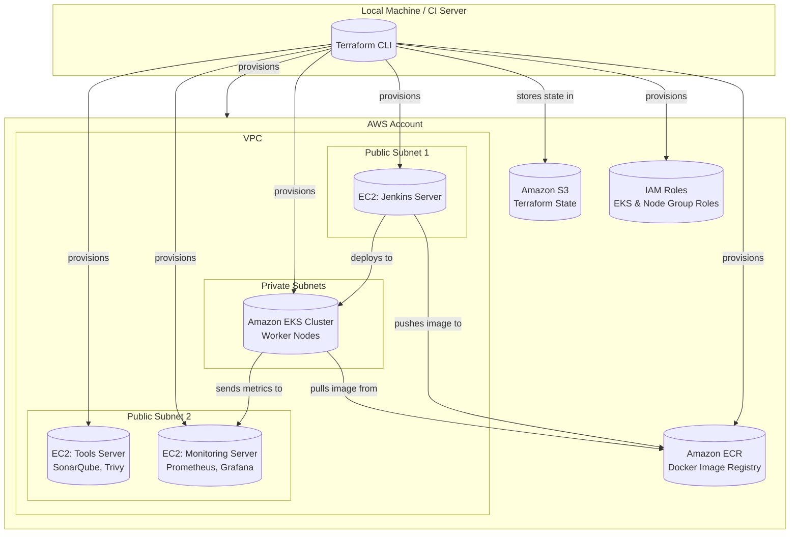

# DevOps Project - Terraform Infrastructure

This repository contains the Terraform code used to provision the complete AWS infrastructure for the DevOps L2 project.

## Overview

This Terraform setup automates the creation of a robust and scalable environment on AWS. It includes networking, compute resources for CI/CD and monitoring, and a container orchestration platform for deploying the application.

## Architecture

The following resources are created and managed by this Terraform code:

-   **VPC**: A custom Virtual Private Cloud with public and private subnets across multiple Availability Zones for network isolation and high availability.
-   **EC2 Instances**:
    -   **Jenkins Server**: A dedicated instance for running the Jenkins CI/CD server.
    -   **Tools Server**: A dedicated instance for hosting SonarQube (for code quality) and Trivy (for vulnerability scanning).
    -   **Monitoring Server**: A dedicated instance for running Prometheus (for metrics collection) and Grafana (for visualization and dashboards).
-   **Amazon EKS (Elastic Kubernetes Service)**: A managed Kubernetes cluster for deploying and scaling the containerized application.
-   **Amazon ECR (Elastic Container Registry)**: A private Docker registry to store and manage application container images.
-   **Amazon S3**: A secure S3 bucket is used to store the Terraform state file, enabling team collaboration and state locking.
-   **IAM Roles**: Necessary IAM roles and policies are created to grant the required permissions to EKS and other services securely.

### Architecture Diagram

## How to Use

1.  **Clone the repository.**
2.  **Configure AWS Credentials**: Make sure your AWS credentials are configured correctly on the machine where you will run Terraform (e.g., via environment variables `AWS_ACCESS_KEY_ID` and `AWS_SECRET_ACCESS_KEY`).
3.  **Create the S3 Backend Bucket**: Before the first run, you must manually create the S3 bucket specified in `providers.tf`.
4.  **Initialize Terraform**: Run `terraform init` to initialize the backend and download the necessary providers.
5.  **Review the Plan**: Run `terraform plan` to see the resources that will be created.
6.  **Apply the Changes**: Run `terraform apply` to create the infrastructure. 